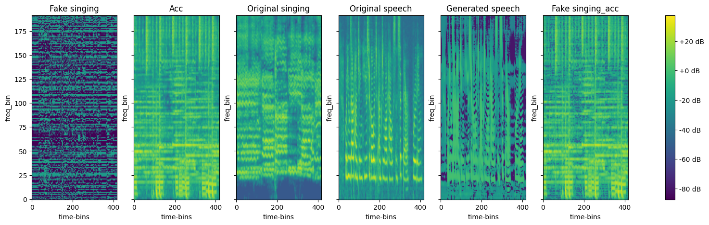
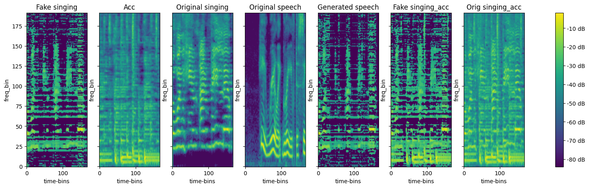
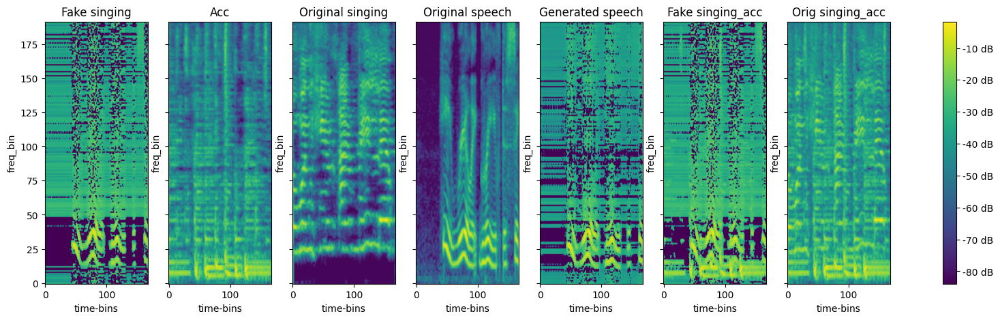

# speech2sing
Note: it is recommanded to clone/fork the repository in order to read the README.md with the exampled audio. Currently, github don't support playing audio files. 
# Prepare data:
Takes splited songs (vocals and accompaniment) and create dataset from them (split into 2 seconds files of singing and accompaniment pairs).

# Spleeter
Run spleeter on songs in folder to spleet them into vocals and accompaniment.

# MelGAN-VC
## MelGAN-VC with power loss
Run MelGAN with power loss factor. Original name: Speech2Sing_Ofir.ipynb

### results sample:

[Generated Singing](./MelGAN-VC/results/with-power-loss/1/generated_singing.wav);
[Generated Speech](./MelGAN-VC/results/with-power-loss/1/generated_speech.wav);
[Original Speech](./MelGAN-VC/results/with-power-loss/1/original_speech.wav);
[Complete Song Output](./MelGAN-VC/results/with-power-loss/1/fake_combine.wav);

<figure>
  <figcaption>Generated Singing:</figcaption>
  <audio controls>
    <source src="./MelGAN-VC/results/with-power-loss/1/generated_singing.wav" type="audio/mpeg">
  </audio>
</figure>

<figure>
  <figcaption>Generated Speech:</figcaption>
  <audio controls>
    <source src="./MelGAN-VC/results/with-power-loss/1/generated_speech.wav" type="audio/mpeg">
  </audio>
</figure>
<figure>
  <figcaption>Original Speech:</figcaption>
  <audio controls>
    <source src="./MelGAN-VC/results/with-power-loss/1/original_speech.wav" type="audio/mpeg">
  </audio>
</figure>
<figure>
  <figcaption>Complete Song Output:</figcaption>
  <audio controls>
    <source src="./MelGAN-VC/results/with-power-loss/1/fake_combine.wav" type="audio/mpeg">
  </audio>
</figure>

## MelGAN-VC with Identity force and Normalize mel-spectrogram data
Original name: Speech2Sing_Ofir_V8_identity_force_lower_acc.ipynb

Normaize both input and generated mel-spectrogram to make sure discriminator have to address all component equally. Add singing as speech output as well, and add identity-loss when the input speech is actually a singing input.

### Singing as input - results sample:

[Generated Singing](./MelGAN-VC/results/identity-force-and-normalization/singing/1/generated_singing.wav);
[Generated Speech](./MelGAN-VC/results/identity-force-and-normalization/singing/1/generated_speech.wav);
[Original Speech](./MelGAN-VC/results/identity-force-and-normalization/singing/1/original_speech.wav);
[Complete Song Output](./MelGAN-VC/results/identity-force-and-normalization/singing/1/fake_combine.wav);

<figure>
  <figcaption>Generated Singing:</figcaption>
  <audio controls>
    <source src="./MelGAN-VC/results/identity-force-and-normalization/singing/1/generated_singing.wav" type="audio/mpeg">
  </audio>
</figure>
<figure>
  <figcaption>Generated Speech:</figcaption>
  <audio controls>
    <source src="./MelGAN-VC/results/identity-force-and-normalization/singing/1/generated_speech.wav" type="audio/mpeg">
  </audio>
</figure>
<figure>
  <figcaption>Original Speech:</figcaption>
  <audio controls>
    <source src="./MelGAN-VC/results/identity-force-and-normalization/singing/1/original_speech.wav" type="audio/mpeg">
  </audio>
</figure>
<figure>
  <figcaption>Complete Song Output:</figcaption>
  <audio controls>
    <source src="./MelGAN-VC/results/identity-force-and-normalization/singing/1/fake_combine.wav" type="audio/mpeg">
  </audio>
</figure>

### Speech as input - results sample:

[Generated Singing](./MelGAN-VC/results/identity-force-and-normalization/speech/1/generated_singing.wav);
[Generated Speech](./MelGAN-VC/results/identity-force-and-normalization/speech/1/generated_speech.wav);
[Original Speech](./MelGAN-VC/results/identity-force-and-normalization/speech/1/original_speech.wav);
[Complete Song Output](./MelGAN-VC/results/identity-force-and-normalization/speech/1/fake_combine.wav);

<figure>
  <figcaption>Generated Singing:</figcaption>
  <audio controls>
    <source src="./MelGAN-VC/results/identity-force-and-normalization/speech/1/generated_singing.wav" type="audio/mpeg">
  </audio>
</figure>
<figure>
  <figcaption>Generated Speech:</figcaption>
  <audio controls>
    <source src="./MelGAN-VC/results/identity-force-and-normalization/speech/1/generated_speech.wav" type="audio/mpeg">
  </audio>
</figure>
<figure>
  <figcaption>Original Speech:</figcaption>
  <audio controls>
    <source src="./MelGAN-VC/results/identity-force-and-normalization/speech/1/original_speech.wav" type="audio/mpeg">
  </audio>
</figure>
<figure>
  <figcaption>Complete Song Output:</figcaption>
  <audio controls>
    <source src="./MelGAN-VC/results/identity-force-and-normalization/speech/1/fake_combine.wav" type="audio/mpeg">
  </audio>
</figure>

# HifiGAN
Use HifiGAN generators, discriminators and losses. Input is the original speech with lower accompaniment.

Original name: Speech2Sing_Ofir_HifiGAN.ipynb

### results sample:
[Generated Singing](./HifiGAN/results/base/1/generated_singing.wav);
[Generated Speech](./HifiGAN/results/base/1/generated_speech.wav);
[Original Speech With Background](./HifiGAN/results/base/1/original_speech_with_background.wav);

<figure>
  <figcaption>Generated Singing:</figcaption>
  <audio controls>
    <source src="./HifiGAN/results/base/1/generated_singing.wav" type="audio/mpeg">
  </audio>
</figure>
<figure>
  <figcaption>Generated Speech:</figcaption>
  <audio controls>
    <source src="./HifiGAN/results/base/1/generated_speech.wav" type="audio/mpeg">
  </audio>
</figure>
<figure>
  <figcaption>Original Speech With Background:</figcaption>
  <audio controls>
    <source src="./HifiGAN/results/base/1/original_speech_with_background.wav" type="audio/mpeg">
  </audio>
</figure>

# Classic Approch
Classic approches to manipulate the speech into singing that fits given midi notes.

### result samples (on barbie girl):

### Syllables Manipulation

sentence: "Don't ask me to carry an"

<figure>
  <figcaption>Original Audio:</figcaption>
  <audio controls>
    <source src="./Phonemes-Syllables-Singing/results/syllables/1/original audio.wav" type="audio/mpeg">
  </audio>
</figure>
<figure>
  <figcaption>Output Audio:</figcaption>
  <audio controls>
    <source src="./Phonemes-Syllables-Singing/results/syllables/1/output audio.wav" type="audio/mpeg">
  </audio>
</figure>

### Words Manipulation

sentence: "She had your dark suit in greasy wash water all year"

<figure>
  <figcaption>Original Audio:</figcaption>
  <audio controls>
    <source src="./Phonemes-Syllables-Singing/results/words/1/original audio.wav" type="audio/mpeg">
  </audio>
</figure>
<figure>
  <figcaption>Output Audio:</figcaption>
  <audio controls>
    <source src="./Phonemes-Syllables-Singing/results/words/1/output audio.wav" type="audio/mpeg">
  </audio>
</figure>

### Phonemes Manipulation

sentence: "Don't ask me to carry an oily rag like that"

<figure>
  <figcaption>Original Audio:</figcaption>
  <audio controls>
    <source src="./Phonemes-Syllables-Singing/results/phonemes/1/original audio.wav" type="audio/mpeg">
  </audio>
</figure>
<figure>
  <figcaption>Output Audio:</figcaption>
  <audio controls>
    <source src="./Phonemes-Syllables-Singing/results/phonemes/1/output audio.wav" type="audio/mpeg">
  </audio>
</figure>

### Time Manipulation (do not mind content)

input: wave of sinus

<figure>
  <figcaption>Original Audio:</figcaption>
  <audio controls>
    <source src="./Phonemes-Syllables-Singing/results/time/wave/1/original audio.wav" type="audio/mpeg">
  </audio>
</figure>
<figure>
  <figcaption>Output Audio:</figcaption>
  <audio controls>
    <source src="./Phonemes-Syllables-Singing/results/time/wave/1/output audio.wav" type="audio/mpeg">
  </audio>
</figure>

sentence: Don't ask me to carry an oily rag like that

<figure>
  <figcaption>Original Audio:</figcaption>
  <audio controls>
    <source src="./Phonemes-Syllables-Singing/results/time/sentence/1/original audio.wav" type="audio/mpeg">
  </audio>
</figure>
<figure>
  <figcaption>Output Audio:</figcaption>
  <audio controls>
    <source src="./Phonemes-Syllables-Singing/results/time/sentence/1/output audio.wav" type="audio/mpeg">
  </audio>
</figure>

# FreeVC
Use FreeVC As-Is and train it on speech and singing input, got some intresting results.

### result samples:

### taylor swift singing to taylor swift speech
<figure>
  <figcaption>Original Audio:</figcaption>
  <audio controls>
    <source src="./FreeVC/results/to-taylor-speech/taylor-singing/1/original.wav" type="audio/mpeg">
  </audio>
</figure>
<figure>
  <figcaption>Converted Audio:</figcaption>
  <audio controls>
    <source src="./FreeVC/results/to-taylor-speech/taylor-singing/1/converted.wav" type="audio/mpeg">
  </audio>
</figure>

### the beatles singing to taylor swift speech
<figure>
  <figcaption>Original Audio:</figcaption>
  <audio controls>
    <source src="./FreeVC/results/to-taylor-speech/the-beatles-singing/1/original.wav" type="audio/mpeg">
  </audio>
</figure>
<figure>
  <figcaption>Converted Audio:</figcaption>
  <audio controls>
    <source src="./FreeVC/results/to-taylor-speech/the-beatles-singing/1/converted.wav" type="audio/mpeg">
  </audio>
</figure>

### female librispeech to taylor swift speech
<figure>
  <figcaption>Original Audio:</figcaption>
  <audio controls>
    <source src="./FreeVC/results/to-taylor-speech/female-librispeech/1/original.wav" type="audio/mpeg">
  </audio>
</figure>
<figure>
  <figcaption>Converted Audio:</figcaption>
  <audio controls>
    <source src="./FreeVC/results/to-taylor-speech/female-librispeech/1/converted.wav" type="audio/mpeg">
  </audio>
</figure>

